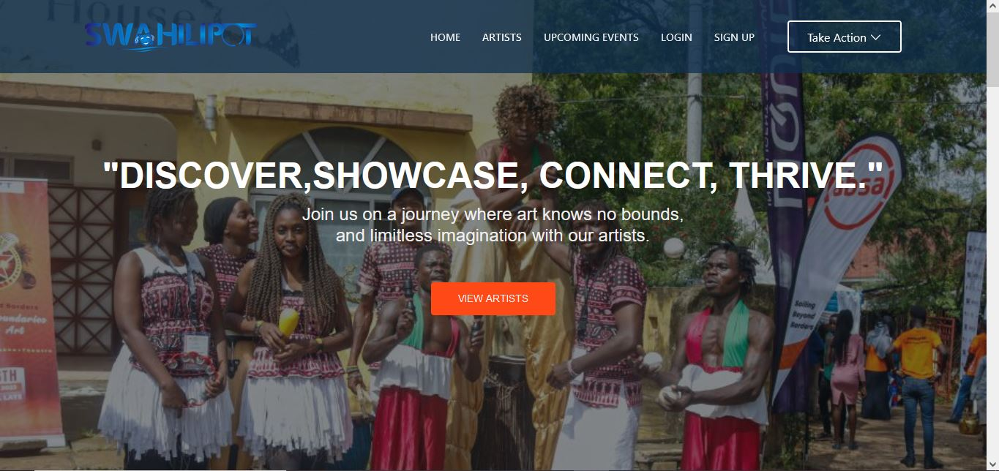
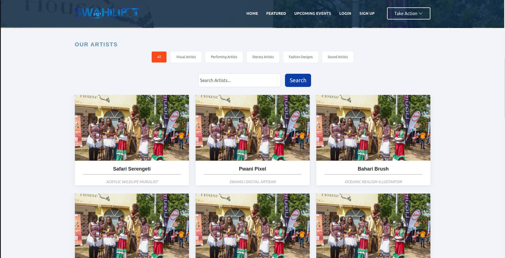

<a name="readme-top"></a>

[![Contributors][contributors-shield]][contributors-url]
[![Forks][forks-shield]][forks-url]
[![Stargazers][stars-shield]][stars-url]
[![Issues][issues-shield]][issues-url]
<!-- [![MIT License][license-shield]][license-url] -->


<!-- PROJECT LOGO -->
<br />
<div align="center">

<h3 align="center">ARTISTS MANAGEMENT SYSTEM</h3>

  <p align="center">
    
Welcome to the Artists Management project repository! This project aims to create an Artists Management System/Platform for Swahilipot Hub members, which will enable better organization, presentation, and dissemination of artist's profiles and their works.Artists will be able to showcase their work and for art enthusiasts to discover, engage with, and support artists. Whether you're an artist, developer, designer, or just interested in art, we welcome your contributions and collaboration.
    <br />
    <br />
    <a href="https://artists-git-main-svmuelis-projects.vercel.app/">View Demo</a>
    ·
    <a href="https://github.com/Swahilipot-Hub-Developers/artists/issues">Report Bug</a>
    ·
    <a href="https://github.com/Swahilipot-Hub-Developers/artists/issues">Request Feature</a>
  </p>
</div>


<!-- TABLE OF CONTENTS -->
<details>
  <summary>Table of Contents</summary>
  <ol>
    <li>
      <a href="#about-the-project">About The Project</a>
      <ul>
        <li><a href="#built-with">Built With</a></li>
      </ul>
    </li>
    <li>
      <a href="#getting-started">Getting Started</a>
      <ul>
        <li><a href="#prerequisites">Prerequisites</a></li>
        <li><a href="#installation">Installation</a></li>
        <ul>
          <li><a href="#frontend">Frontend (Next.js)</a></li>
          <li><a href="#backend">Backend (django)</a></li>
        </ul>
      </ul>
    </li>
    <li><a href="#features">Features and Functionalities</a></li>
    <li><a href="#contributing">Contributing</a></li>
    <li><a href="#license">License</a></li>
    <li><a href="#contact">Contact</a></li>
    <li><a href="#acknowledgments">Acknowledgments</a></li>
  </ol>
</details>


<!-- ABOUT THE PROJECT -->
## About The Project





<p align="right">(<a href="#readme-top">back to top</a>)</p>


### Built With

* [![Next][Next.js]][Next-url]
* [![Bootstrap][Bootstrap.com]][Bootstrap-url]
* [](https://www.python.org/)
* [](https://www.djangoproject.com/)

<p align="right">(<a href="#readme-top">back to top</a>)</p>


<!-- GETTING STARTED -->
## Getting Started

This section provides instructions on setting up the Swahilipot Artists Management System locally. It encompasses steps to initialize both the frontend and backend development environments within the monorepo structure.

### Prerequisites

- [Python](https://www.python.org) installed

- [Node.js](https://nodejs.org) installed

- [Git](https://git-scm.com) for version control

- **npm or yarn**
 <br />*npm comes with Node.js installation. To install yarn:*
  ```sh
  npm install -g yarn
  ```

- **npm or yarn**
 <br />*pip usually comes with Python installation. To ensure it's up to date:*
  ```sh
  python -m pip install --upgrade pip
  ```


### Installation:

### Frontend

1. Clone the repo
   ```sh
   git clone https://github.com/Swahilipot-Hub-Developers/artists.git
   ```
2. Navigate to Backend Directory:
   ```sh
   cd frontend
   ```

3. Install Frontend Dependencies
   ```sh
   npm install   # or using yarn: yarn install
   ```
4. Run the Frontend Development Server:
   ```sh
   npm run dev   # or using yarn: yarn dev
   ```

   <p align="right">(<a href="#readme-top">back to top</a>)</p>

### Backend

1. Navigate to Backend Directory:
   ```sh
   cd backend
   ```

2. Create and Activate a Virtual Environment (Optional but Recommended):
   ```sh
   python3 -m venv venv         # Create a virtual environment
   ```
   ```sh
   source venv/bin/activate    # Activate the virtual environment (for Unix systems)
   ```
3. Install Django and Dependencies:
   ```sh
   pip install -r requirements.txt
   ```

3. Run Backend Migrations:
   ```sh
   python manage.py makemigrations
   ```

   ```sh
   python manage.py migrate
   ```
4. Start the Backend server:
   ```sh
   python manage.py runserver
   ```

   <p align="right">(<a href="#readme-top">back to top</a>)</p>


## Features

### 1. Database Filtering
- Capability to filter artists based on criteria like name, talent/skill, work type, etc.
- Advanced search functionalities for specific skills or talents.

### 2. Artist Profile
- **Image:** High-quality artist profile picture.
- **Bio:** Artist's background, inspirations, and journey.
- **Talents/Skills:** Categorized list of skills or talents.
- **Work Done:** Portfolio showcasing previous and current works (images, videos, audio clips, external project links).
- **Contact Details:** Securely presented for potential clients or interested parties.

### 3. Work Sharing Capabilities
- Artists can share, update, or remove their works.
- Support for various media types: photos, videos, audio files, text descriptions.
- User-friendly interface for easy sharing.

### 4. Security and Privacy
- Secure storage of artist data, especially contact details.
- Robust privacy settings for artists.
- Control over who can view their contact details or personal information.

### 5. User Experience (UX) and User Interface (UI)
- Visually appealing, intuitive, and easy-to-navigate platform.
- Responsive design for accessibility across devices.

### 6. Notifications & Updates
- Artists receive notifications for new comments, feedback, or interests in their works.
- Option for artists to send out updates related to their work or events.

### 7. Implementation Considerations
- Scalability for handling a large number of artist profiles and works.
- Regular backup solutions to prevent data loss.
- Incorporation of analytics to track user engagement and popular profiles.

_For more examples, please refer to the [Documentation]()_

<p align="right">(<a href="#readme-top">back to top</a>)</p>


<!-- ROADMAP -->
## Roadmap

- [ ] Feature 1
- [ ] Feature 2

See the [open issues](https://github.com/Swahilipot-Hub-Developers/artists/issues) for a full list of proposed features (and known issues).

<p align="right">(<a href="#readme-top">back to top</a>)</p>


<!-- CONTRIBUTING -->
## Contributing

Contributions are what make the open source community such an amazing place to learn, inspire, and create. Any contributions you make are **greatly appreciated**.

1. Fork the Project by clicking the "Fork" button at the top right of the repository page.

2. Clone the forked repository to your local machine:
   ```sh
   git clone https://github.com/Swahilipot-Hub-Developers/artists.git
   ```
2. Create your Feature Branch
   ```sh
   git checkout -b feature/AmazingFeature
   ```
3. Commit your Changes
   ```sh
   git commit -m 'Add some AmazingFeature'
   ```
4. Push to the Branch
     ```sh
   git push origin feature/AmazingFeature
   ```
5. Open a Pull Request

<p align="right">(<a href="#readme-top">back to top</a>)</p>


<!-- LICENSE -->
## License

Distributed under the MIT License.

<p align="right">(<a href="#readme-top">back to top</a>)</p>


<!-- CONTACT -->
## Contact

Project Link: [https://github.com/Swahilipot-Hub-Developers/artists](https://github.com/Swahilipot-Hub-Developers/artists)

<p align="right">(<a href="#readme-top">back to top</a>)</p>


<!-- ACKNOWLEDGMENTS -->
## Acknowledgments

* []()
* []()

<p align="right">(<a href="#readme-top">back to top</a>)</p>

Stay tuned for updates and improvements! 🎉


<!-- MARKDOWN LINKS & IMAGES -->
[contributors-shield]: https://img.shields.io/github/contributors/Swahilipot-Hub-Developers/artists.svg?style=for-the-badge
[contributors-url]: https://github.com/Swahilipot-Hub-Developers/artists/graphs/contributors
[forks-shield]: https://img.shields.io/github/forks/Swahilipot-Hub-Developers/artists.svg?style=for-the-badge
[forks-url]: https://github.com/Swahilipot-Hub-Developers/artists/network/members
[stars-shield]: https://img.shields.io/github/stars/Swahilipot-Hub-Developers/artists.svg?style=for-the-badge
[stars-url]: https://github.com/Swahilipot-Hub-Developers/artists/stargazers
[issues-shield]: https://img.shields.io/github/issues/Swahilipot-Hub-Developers/artists.svg?style=for-the-badge
[issues-url]: https://github.com/Swahilipot-Hub-Developers/artists/issues
[license-shield]: https://img.shields.io/github/license/Swahilipot-Hub-Developers/artists.svg?style=for-the-badge
[license-url]: https://github.com/Swahilipot-Hub-Developers/artists/blob/master/LICENSE.txt
[product-screenshot]: images/screenshot.png
[Next.js]: https://img.shields.io/badge/next.js-000000?style=for-the-badge&logo=nextdotjs&logoColor=white
[Next-url]: https://nextjs.org/
[React.js]: https://img.shields.io/badge/React-20232A?style=for-the-badge&logo=react&logoColor=61DAFB
[React-url]: https://reactjs.org/
[Bootstrap.com]: https://img.shields.io/badge/Bootstrap-563D7C?style=for-the-badge&logo=bootstrap&logoColor=white
[Bootstrap-url]: https://getbootstrap.com
